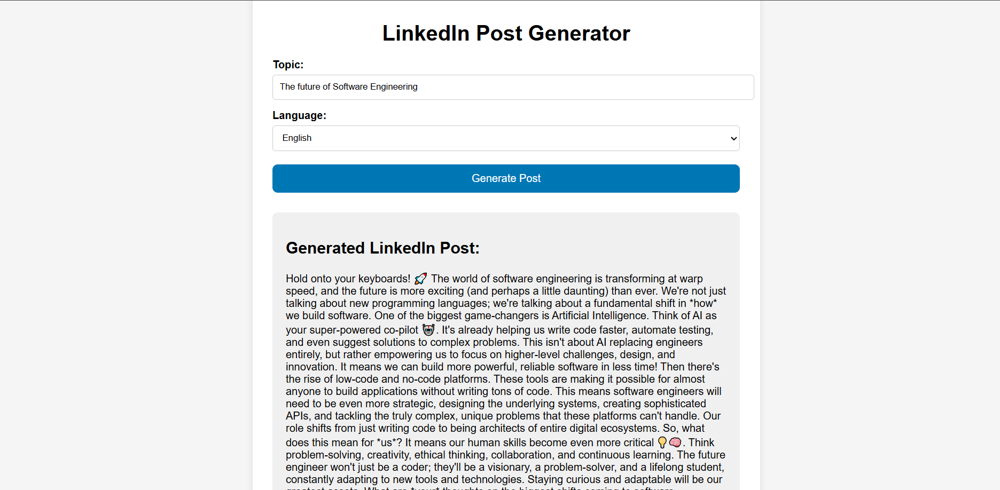
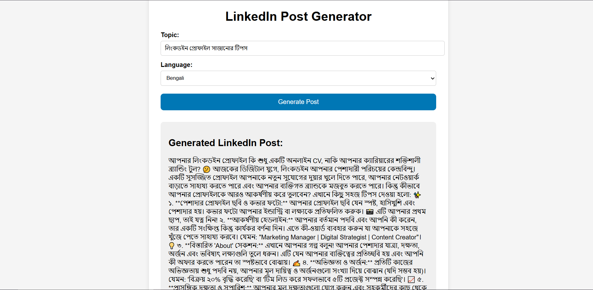
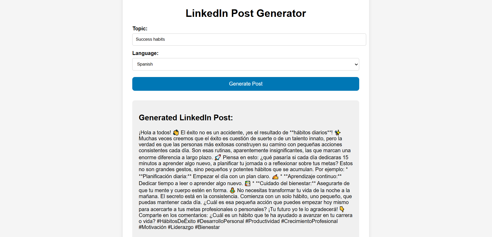

# 🚀 LinkedIn Post Generator AI

A full-stack AI-powered web application that generates professional LinkedIn posts based on user topics. Built with **React**, **FastAPI**, **LangChain**, and **Google Gemini AI**.

## 🌟 Features

- **AI-Powered Content:** Generates engaging LinkedIn posts using Google's Gemini models (e.g., Gemini 2.5 Flash).
- **Multilingual Support:** Create posts in **English**, **Bengali**, and **Spanish**.
- **Customizable:** Generates posts with hooks, emojis, and hashtags automatically.
- **Fast & Responsive:** Built with FastAPI for high performance and React for a smooth UI.

## 🛠️ Tech Stack

- **Frontend:** React.js, CSS
- **Backend:** Python, FastAPI, Uvicorn
- **AI & LLM:** LangChain, Google Generative AI (Gemini)
- **Environment:** Dotenv for API security

---

## ⚙️ Installation & Setup

Follow these steps to run the project locally.

1. Clone the Repository
2. Environment Setup
python -m venv env
env\Scripts\activate
3. Install dependencies
pip install -r requirements.txt

# Run the Backend Server
uvicorn main:app --reload

# Frontend Setup
npm install
npm start

# Usage
Enter a Topic (e.g., "Artificial Intelligence in 2026").

Select a Language (English, Bengali, or Spanish).

Click "Generate Post".

Copy the generated content and post it on LinkedIn! 🚀

# 📸 Screenshots

